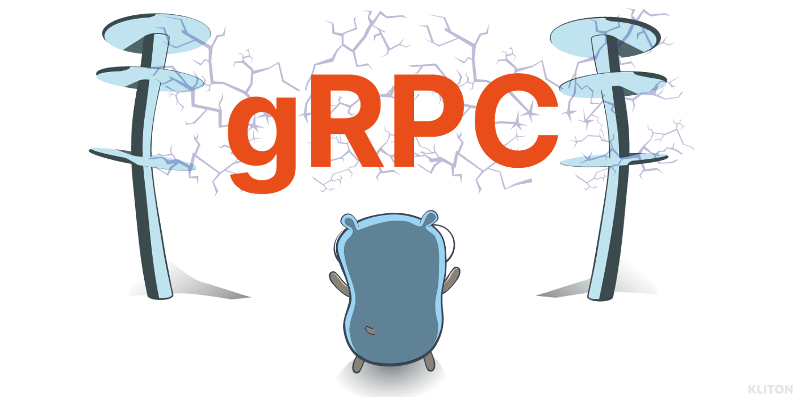
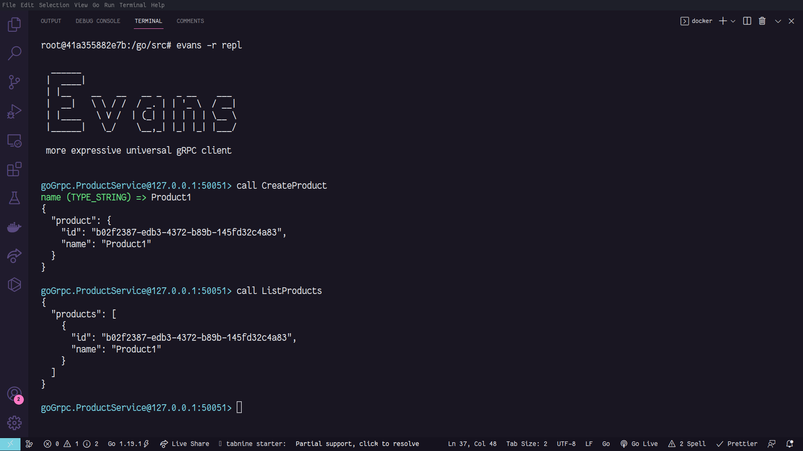

<p align="center">
  
</p>

# Golang + gRPC

## Overview

This application implements a gRPC server with two services and a client to handle with requests, it also has a Server Streaming implementation.

- [x] gRPC Secure connection with SSL/TLS
- [x] gRPC Server
- [x] gRPC Server streaming
- [x] gRPC Service
- [x] gRPC Client
- [x] gRPC .proto
- [x] Evans Client gRPC
- [x] HTTP Server
- [x] Docker + Docker Compose

---

## Setup

### Clone repository

```bash
$ git clone https://github.com/Sup3r-Us3r/grpc-go-example
$ cd grpc-go-example
```

### Install dependencies

```bash
$ go mod tidy
```

### Configure certificate

First for you configure gRPC connection with SSL/TLS you need to edit this [generate.sh](./grpc/cert/generate.sh) file, and change the following information:

> `/C`=BR is for country

> `/ST`=Minas Gerais is for state or province

> `/L`=Belo Horizonte is for locality name or city

> `/O`=Example is for organisation

> `/OU`=Education is for organisation unit

> `/CN`=\*.test is for common name or domain name

> `/emailAddress`=test@gmail.com is for email address

Now run this command to generate the certificate, but it is important that you have openssl installed, if you run this command inside the container the image already has openssl installed:

```bash
$ make cert
```

### Run app

The environment were configured using Docker Compose, to start the environment you must run:

```bash
$ docker-compose up -d
```

Access the application container:

```bash
$ docker exec -it go-grpc-app /bin/bash
```

Now start server:

```bash
$ go run main.go
```

### Use gRPC client

For each created service you can use the client that was implemented to perform the request:

```bash
$ go run grpc/client/main.go
```

> As this is just an example, when executing the above command the request will be made to the three existing services, you can comment on any that you do not want to be executed in your tests in `grpc/client/main.go` in the function `main`.

### Use the Evans gRPC client

Open a new terminal and access the container app again, and run this command:

> gRPC without security

```bash
$ evans -r repl
```

There is only 2 RPC in the `ProductService` and 1 RPC in the `SmartwatchService`.

To use RPC `CreateProduct` run:

```txt
goGrpc.ProductService@127.0.0.1:50051> call CreateProduct
```

To use RPC `ListProducts` run:

```txt
goGrpc.ProductService@127.0.0.1:50051> call ListProducts
```

To use RPC `BeatsPerMinute` run:

```txt
goGrpc.SmartwatchService@127.0.0.1:50051> call BeatsPerMinute
```



### Protobuf

For the `.proto` files that are used to define the contract, in case you want to modify something, or need to create new files, it is necessary to use `protoc` to generate the `.pb` and `grpc.pb` files.

Use the command below in the root of the project that uses `protoc` internally:

```bash
$ make gen
```
